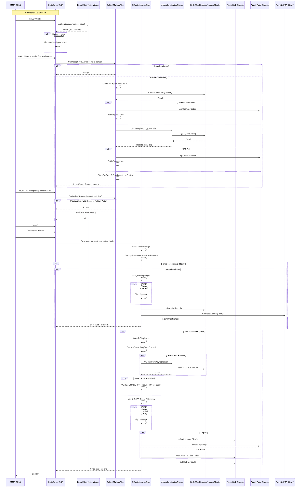

# BLAZOR SMTP SERVER
## Read the Blog post: [Create Your Own SMTP Server Using Aspire 13](https://blazorhelpwebsite.com/ViewBlogPost/20080)
## Also see: [https://github.com/ADefWebserver/BlazorSMTPForwarder](https://github.com/ADefWebserver/BlazorSMTPForwarder)

# SMTPServerSvc Program Flow

This diagram illustrates the flow of an SMTP session within the `SMTPServerSvc` project, from connection to message storage.

Also see: [https://github.com/ADefWebserver/BlazorSMTPForwarder](https://github.com/ADefWebserver/BlazorSMTPForwarder)
