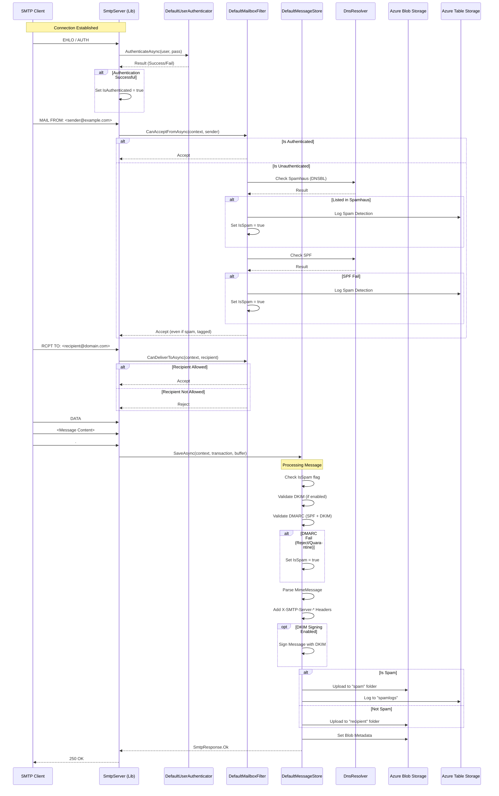

# SMTPServerSvc Program Flow

This diagram illustrates the flow of an SMTP session within the `SMTPServerSvc` project, from connection to message storage.

```mermaid
sequenceDiagram
    participant Client as SMTP Client
    participant Server as SmtpServer (Lib)
    participant Auth as DefaultUserAuthenticator
    participant Filter as DefaultMailboxFilter
    participant Store as DefaultMessageStore
    participant DNS as DnsResolver
    participant Blob as Azure Blob Storage
    participant Table as Azure Table Storage

    Note over Client, Server: Connection Established

    %% Authentication Phase
    Client->>Server: EHLO / AUTH
    Server->>Auth: AuthenticateAsync(user, pass)
    Auth-->>Server: Result (Success/Fail)
    
    alt Authentication Successful
        Server->>Server: Set IsAuthenticated = true
    end

    %% Mail From Phase
    Client->>Server: MAIL FROM: <sender@example.com>
    Server->>Filter: CanAcceptFromAsync(context, sender)
    
    alt Is Authenticated
        Filter-->>Server: Accept
    else Is Unauthenticated
        Filter->>DNS: Check Spamhaus (DNSBL)
        DNS-->>Filter: Result
        
        alt Listed in Spamhaus
            Filter->>Table: Log Spam Detection
            Filter->>Filter: Set IsSpam = true
        end

        Filter->>DNS: Check SPF
        DNS-->>Filter: Result
        
        alt SPF Fail
            Filter->>Table: Log Spam Detection
            Filter->>Filter: Set IsSpam = true
        end
        
        Filter-->>Server: Accept (even if spam, tagged)
    end

    %% Rcpt To Phase
    Client->>Server: RCPT TO: <recipient@domain.com>
    Server->>Filter: CanDeliverToAsync(context, recipient)
    
    alt Recipient Allowed
        Filter-->>Server: Accept
    else Recipient Not Allowed
        Filter-->>Server: Reject
    end

    %% Data Phase
    Client->>Server: DATA
    Client->>Server: <Message Content>
    Client->>Server: .
    Server->>Store: SaveAsync(context, transaction, buffer)

    Note over Store: Processing Message

    Store->>Store: Check IsSpam flag
    Store->>Store: Validate DKIM (if enabled)
    Store->>Store: Validate DMARC (SPF + DKIM)
    
    alt DMARC Fail (Reject/Quarantine)
        Store->>Store: Set IsSpam = true
    end

    Store->>Store: Parse MimeMessage
    Store->>Store: Add X-SMTP-Server-* Headers
    
    opt DKIM Signing Enabled
        Store->>Store: Sign Message with DKIM
    end

    alt Is Spam
        Store->>Blob: Upload to "spam" folder
        Store->>Table: Log to "spamlogs"
    else Not Spam
        Store->>Blob: Upload to "recipient" folder
    end
    
    Store->>Blob: Set Blob Metadata
    Store-->>Server: SmtpResponse.Ok
    Server-->>Client: 250 OK
```
